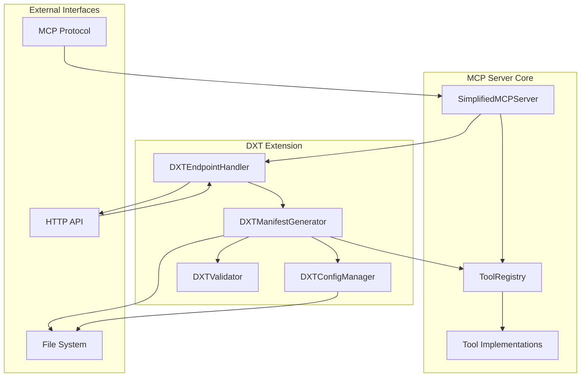

# Design Document

## Overview

This design adds DXT (Desktop Extension Toolkit) manifest support to the existing Simplified MCP Server. The implementation will extend the current server architecture to generate, validate, and serve DXT manifest files that expose MCP tools as DXT capabilities. This enables the MCP server to function as a DXT extension provider, allowing desktop applications to discover and integrate with the available tools.

The design follows a modular approach, adding new components without disrupting the existing MCP functionality. The DXT manifest will be dynamically generated based on the current tool registry state, ensuring it always reflects available capabilities.

## Architecture

### High-Level Architecture



### Component Integration

The DXT support will be integrated into the existing server architecture through:

1. **DXTManifestGenerator**: Core component that converts MCP tools to DXT format
2. **DXTConfigManager**: Handles DXT-specific configuration and metadata
3. **DXTValidator**: Validates generated manifests against DXT specifications
4. **DXTEndpointHandler**: HTTP endpoint handler for serving manifests
5. **Server Integration**: Minimal changes to SimplifiedMCPServer to enable DXT support

## Components and Interfaces

### DXTManifestGenerator

**Purpose**: Convert MCP tool definitions to DXT manifest format

**Key Methods**:
```typescript
interface DXTManifestGenerator {
  generateManifest(): Promise<DXTManifest>
  convertToolToCapability(tool: ToolDefinition): DXTCapability
  updateManifestFile(): Promise<void>
  getManifest(): DXTManifest | null
}
```

**Responsibilities**:
- Convert MCP tools to DXT capabilities
- Generate complete DXT manifest structure
- Handle manifest file I/O operations
- Maintain manifest cache for performance

### DXTConfigManager

**Purpose**: Manage DXT-specific configuration and metadata

**Key Methods**:
```typescript
interface DXTConfigManager {
  loadConfig(): DXTConfig
  getManifestMetadata(): DXTMetadata
  validateConfig(): boolean
}
```

**Configuration Structure**:
```typescript
interface DXTConfig {
  manifest: {
    name?: string
    version?: string
    description?: string
    author?: string
    homepage?: string
    repository?: string
    license?: string
    keywords?: string[]
  }
  capabilities: {
    excludeTools?: string[]
    includeCategories?: string[]
    customMappings?: Record<string, Partial<DXTCapability>>
  }
}
```

### DXTValidator

**Purpose**: Validate DXT manifests against specification requirements

**Key Methods**:
```typescript
interface DXTValidator {
  validateManifest(manifest: DXTManifest): ValidationResult
  validateCapability(capability: DXTCapability): ValidationResult
  checkRequiredFields(manifest: DXTManifest): ValidationResult
}
```

### DXTEndpointHandler

**Purpose**: Handle HTTP requests for DXT manifest serving

**Key Methods**:
```typescript
interface DXTEndpointHandler {
  handleManifestRequest(req: Request, res: Response): Promise<void>
  setupRoutes(app: Express): void
  enableCORS(): void
}
```

**Endpoints**:
- `GET /dxt/manifest` - Serve current DXT manifest
- `GET /dxt/manifest.json` - Alternative endpoint for manifest
- `GET /dxt/health` - Health check for DXT functionality

### Server Integration

**Changes to SimplifiedMCPServer**:
- Add optional HTTP server for DXT endpoints
- Initialize DXT components during server startup
- Integrate manifest generation with tool registration
- Add configuration options for DXT features

## Data Models

### DXT Manifest Structure

```typescript
interface DXTManifest {
  name: string
  version: string
  description: string
  author?: string
  homepage?: string
  repository?: string
  license?: string
  keywords?: string[]
  capabilities: DXTCapability[]
  metadata: {
    generatedAt: string
    mcpServerVersion: string
    toolCount: number
  }
}
```

### DXT Capability Structure

```typescript
interface DXTCapability {
  name: string
  description: string
  category?: string
  version?: string
  parameters: DXTParameter[]
  returns: {
    type: string
    description: string
  }
  examples?: DXTExample[]
}
```

### DXT Parameter Structure

```typescript
interface DXTParameter {
  name: string
  type: string
  description: string
  required: boolean
  default?: any
  enum?: any[]
  constraints?: {
    minLength?: number
    maxLength?: number
    minimum?: number
    maximum?: number
    pattern?: string
  }
}
```

### Tool to Capability Mapping

**Mapping Strategy**:
1. **Direct Field Mapping**: Map common fields directly (name, description)
2. **Schema Conversion**: Convert JSON Schema to DXT parameter format
3. **Category Preservation**: Maintain tool categories as capability categories
4. **Metadata Enhancement**: Add DXT-specific metadata and examples

**Conversion Rules**:
- MCP tool `name` → DXT capability `name`
- MCP tool `description` → DXT capability `description`
- MCP tool `category` → DXT capability `category`
- MCP tool `inputSchema.properties` → DXT capability `parameters`
- MCP tool `inputSchema.required` → DXT parameter `required` flags

## Error Handling

### Error Categories

1. **Configuration Errors**: Invalid DXT configuration or missing metadata
2. **Generation Errors**: Failures during manifest generation or tool conversion
3. **Validation Errors**: DXT manifest validation failures
4. **I/O Errors**: File system operations for manifest persistence
5. **HTTP Errors**: Endpoint serving failures

### Error Handling Strategy

```typescript
interface DXTErrorHandler {
  handleConfigurationError(error: Error): void
  handleGenerationError(error: Error, context: GenerationContext): void
  handleValidationError(errors: ValidationError[]): void
  handleIOError(error: Error, operation: string): void
  handleHTTPError(error: Error, request: Request): Response
}
```

### Error Recovery

- **Graceful Degradation**: Continue MCP functionality even if DXT features fail
- **Fallback Manifests**: Generate minimal manifests when full generation fails
- **Error Logging**: Comprehensive error logging for debugging
- **Retry Logic**: Automatic retry for transient failures

## Testing Strategy

### Unit Testing

**Components to Test**:
- DXTManifestGenerator: Tool conversion and manifest generation
- DXTConfigManager: Configuration loading and validation
- DXTValidator: Manifest validation logic
- DXTEndpointHandler: HTTP request handling

**Test Coverage Goals**:
- 90%+ code coverage for all DXT components
- Edge cases for tool conversion scenarios
- Error handling paths and recovery mechanisms
- Configuration validation scenarios

### Integration Testing

**Integration Scenarios**:
- End-to-end manifest generation from tool registry
- HTTP endpoint serving with various request scenarios
- File system operations for manifest persistence
- Integration with existing MCP server functionality

### Test Data

**Mock Tools**: Create representative MCP tools covering:
- Different parameter types and constraints
- Various categories and complexity levels
- Edge cases (no parameters, complex schemas)
- Error scenarios (invalid tools, missing data)

**Expected Manifests**: Define expected DXT manifests for test tools to validate conversion accuracy

### Performance Testing

**Performance Metrics**:
- Manifest generation time for large tool sets
- HTTP endpoint response times
- Memory usage during manifest operations
- File I/O performance for manifest persistence

**Performance Goals**:
- Manifest generation: < 100ms for 50 tools
- HTTP response time: < 50ms for manifest serving
- Memory overhead: < 10MB for DXT functionality
- File operations: < 10ms for manifest read/write

### Validation Testing

**DXT Compliance Testing**:
- Validate generated manifests against DXT specification
- Test with DXT-compatible applications
- Verify capability parameter mappings
- Ensure manifest structure correctness