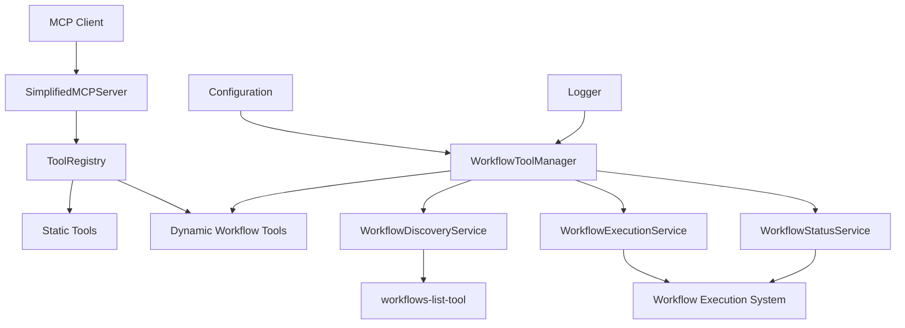

# Design Document: Dynamic Workflow Tools

## Overview

The Dynamic Workflow Tools feature extends the Simplified MCP Server to automatically discover and register tools based on workflows provided by a `workflows-list-tool`. This creates a flexible, extensible system where workflow-based tools are dynamically created at runtime without requiring code changes to the MCP server.

The system will integrate with the existing `ToolRegistry` and server architecture, adding a new `WorkflowToolManager` component that handles workflow discovery, tool generation, and execution management.

## Architecture

### High-Level Architecture



### Component Integration

The dynamic workflow tools will integrate with the existing server architecture by:

1. **Server Initialization**: The `SimplifiedMCPServer` will initialize the `WorkflowToolManager` during startup
2. **Tool Registration**: The `WorkflowToolManager` will register discovered workflow tools with the existing `ToolRegistry`
3. **Tool Execution**: Workflow tools will execute through the same `ToolRegistry.executeTool()` method as static tools
4. **Configuration**: Workflow settings will be added to the existing `ServerConfig` structure

## Components and Interfaces

### 1. WorkflowToolManager

The main orchestrator for dynamic workflow tools.

```typescript
interface WorkflowToolManager {
  // Initialization and lifecycle
  initialize(): Promise<void>;
  shutdown(): Promise<void>;
  
  // Workflow discovery and registration
  discoverWorkflows(): Promise<WorkflowDefinition[]>;
  registerWorkflowTools(workflows: WorkflowDefinition[]): void;
  refreshWorkflows(): Promise<void>;
  
  // Configuration and status
  isEnabled(): boolean;
  getRegisteredWorkflowCount(): number;
  getWorkflowToolNames(): string[];
}
```

### 2. WorkflowDiscoveryService

Handles communication with the workflows-list-tool to discover available workflows.

```typescript
interface WorkflowDiscoveryService {
  // Discovery operations
  listWorkflows(): Promise<WorkflowDefinition[]>;
  validateWorkflow(workflow: any): WorkflowDefinition | null;
  
  // Health checking
  isWorkflowsListToolAvailable(): Promise<boolean>;
  testConnection(): Promise<boolean>;
}
```

### 3. WorkflowExecutionService

Manages the execution of workflow-based tools via API calls.

```typescript
interface WorkflowExecutionService {
  // Execution operations
  executeWorkflow(workflowId: string, parameters: any): Promise<WorkflowExecutionResult>;
  
  // Status and monitoring
  getExecutionStatus(workflowId: string, workflowInstanceId: string): Promise<WorkflowStatus>;
  pollUntilComplete(workflowId: string, workflowInstanceId: string, timeout?: number): Promise<WorkflowStatus>;
  cancelExecution(workflowId: string, workflowInstanceId: string): Promise<boolean>;
  
  // API integration
  buildExecutionPayload(parameters: any): { input: any; source: string };
  buildExecutionEndpoint(workflowId: string): string;
  parseExecutionResponse(response: any): WorkflowExecutionResult;
  
  // Timeout and error handling
  setExecutionTimeout(timeout: number): void;
  handleExecutionError(error: Error, workflowId: string): WorkflowExecutionResult;
}
```

### 4. WorkflowStatusService

Provides status checking capabilities for running workflows.

```typescript
interface WorkflowStatusService {
  // Status operations
  checkStatus(workflowId: string, workflowInstanceId: string): Promise<WorkflowStatus>;
  pollWithInterval(workflowId: string, workflowInstanceId: string, callback: (status: WorkflowStatus) => void): void;
  stopPolling(workflowId: string, workflowInstanceId: string): void;
  
  // Status management
  trackExecution(executionId: string, workflowId: string): void;
  cleanupCompletedExecutions(): void;
}
```

## Data Models

### WorkflowDefinition

Represents a workflow that can be converted to an MCP tool.

```typescript
interface WorkflowDefinition {
  id: string;                    // Unique workflow identifier
  name: string;                  // Tool name for MCP (must be unique)
  description: string;           // Tool description
  category?: string;             // Tool category (defaults to 'workflow')
  version?: string;              // Tool version (defaults to '1.0.0')
  inputSchema: {                 // JSON Schema for parameters
    type: 'object';
    properties: Record<string, any>;
    required?: string[];
  };
  executionType?: 'sync' | 'async'; // Execution type (defaults to 'async')
  metadata?: Record<string, any>;    // Additional workflow metadata
}
```

### WorkflowExecutionResult

Result of workflow execution from Simplified API.

```typescript
interface WorkflowExecutionResult {
  success: boolean;
  correlationId: string;         // correlation_id from API response (e.g., "2724_9a92222c2ca34fffbfd00e8767dd22d0")
  workflowInstanceId: string;    // workflow_id from API response (UUID)
  originalWorkflowId: string;    // Original workflow ID used in request (e.g., "2724")
  
  // From status response
  status: 'RUNNING' | 'COMPLETED' | 'FAILED' | 'CANCELLED';
  input?: Record<string, any>;   // Original input with context from status
  output?: Record<string, any>;  // Workflow output results from status
  error?: string;                // Error message if failed
  
  // Timing information
  startTime?: number;            // start_time from status (timestamp)
  endTime?: number;              // end_time from status (timestamp)
  createTime?: number;           // create_time from status (timestamp)
  updateTime?: number;           // update_time from status (timestamp)
  executionDuration?: number;    // Calculated duration in ms
  
  // Raw API responses for debugging
  executionResponse?: {          // Raw execution response
    correlation_id: string;
    workflow_id: string;
  };
  statusResponse?: WorkflowStatus; // Raw status response
  
  metadata?: Record<string, any>; // Additional execution metadata
}
```

### WorkflowStatus

Status information for running workflows based on actual API response.

```typescript
interface WorkflowStatus {
  // From API response
  create_time: number;           // Creation timestamp (e.g., 1753703781802)
  update_time: number;           // Last update timestamp
  status: 'RUNNING' | 'COMPLETED' | 'FAILED' | 'CANCELLED'; // API uses uppercase
  end_time?: number;             // End timestamp if completed/failed
  start_time: number;            // Start timestamp
  workflow_id: string;           // Original workflow ID (e.g., "2724")
  input: Record<string, any>;    // Original input parameters with context
  output: Record<string, any>;   // Workflow output results
  
  // Processed fields for internal use
  correlationId?: string;        // correlation_id for tracking (from execution response)
  workflowInstanceId?: string;   // workflow_id (UUID) from execution response
  progress?: number;             // Progress percentage if available
  error?: string;                // Extracted error message for failed workflows
}
```

### WorkflowConfig

Configuration for workflow tool functionality.

```typescript
interface WorkflowConfig {
  enabled: boolean;              // Enable/disable workflow tools
  discoveryInterval?: number;    // Auto-refresh interval in ms (0 = disabled)
  executionTimeout?: number;     // Default execution timeout in ms
  maxConcurrentExecutions?: number; // Max concurrent workflow executions
  filterPatterns?: string[];     // Workflow name patterns to include/exclude
  statusCheckInterval?: number;  // Status polling interval in ms
  retryAttempts?: number;        // Retry attempts for failed discoveries
}
```

## Error Handling

### Error Types

The system will handle several types of errors:

1. **Discovery Errors**: When workflows-list-tool is unavailable or returns invalid data
2. **Validation Errors**: When workflow definitions don't match expected schema
3. **Execution Errors**: When workflow execution fails
4. **Timeout Errors**: When workflow execution exceeds timeout limits
5. **Configuration Errors**: When workflow configuration is invalid

### Error Handling Strategy

```typescript
class WorkflowErrorHandler {
  // Discovery error handling
  static handleDiscoveryError(error: Error): void {
    // Log warning and continue with existing tools
    // Schedule retry if configured
  }
  
  // Execution error handling
  static handleExecutionError(error: Error, workflowId: string): WorkflowExecutionResult {
    // Return structured error response
    // Log error details for debugging
  }
  
  // Validation error handling
  static handleValidationError(workflow: any, error: Error): void {
    // Log validation failure
    // Skip invalid workflow
  }
}
```

### Graceful Degradation

- If workflows-list-tool is unavailable, server continues with static tools only
- If individual workflow validation fails, skip that workflow and continue
- If workflow execution fails, return structured error response
- If status checking is not supported, return appropriate "not supported" response

## Testing Strategy

### Unit Tests

1. **WorkflowToolManager Tests**
   - Workflow discovery and registration
   - Configuration handling
   - Error scenarios

2. **WorkflowDiscoveryService Tests**
   - Workflow list retrieval
   - Validation logic
   - Connection handling

3. **WorkflowExecutionService Tests**
   - Workflow execution
   - Timeout handling
   - Error handling

4. **WorkflowStatusService Tests**
   - Status checking
   - Status updates
   - Cleanup operations

### Integration Tests

1. **End-to-End Workflow Tests**
   - Complete workflow discovery to execution flow
   - MCP protocol compliance
   - Error propagation

2. **Tool Registry Integration Tests**
   - Dynamic tool registration
   - Tool execution through registry
   - Tool listing and validation

### Mock Strategy

- Mock workflows-list-tool responses for testing
- Mock workflow execution system for controlled testing
- Use test configurations for different scenarios
- Mock API client for isolated testing

## Implementation Plan Integration

### Configuration Updates

Extend the existing `ServerConfig` to include workflow settings:

```typescript
// Add to existing ConfigSchema in configuration.ts
const WorkflowConfigSchema = z.object({
  workflowsEnabled: z.boolean().default(false),
  workflowDiscoveryInterval: z.number().min(0).default(0),
  workflowExecutionTimeout: z.number().positive().default(300000), // 5 minutes
  workflowMaxConcurrentExecutions: z.number().positive().default(10),
  workflowFilterPatterns: z.array(z.string()).default([]),
  workflowStatusCheckInterval: z.number().positive().default(5000),
  workflowRetryAttempts: z.number().min(0).default(3)
});
```

### Server Integration

The `SimplifiedMCPServer` will be extended to:

1. Initialize `WorkflowToolManager` during startup
2. Register workflow tools with the existing `ToolRegistry`
3. Handle workflow tool execution through existing handlers
4. Provide workflow-specific endpoints if needed

### Tool Registry Integration

The existing `ToolRegistry` will work seamlessly with workflow tools since they implement the same `ToolDefinition` interface. No changes needed to the registry itself.

### API Client Integration

Workflow tools will use the existing `SimplifiedAPIClient` to make POST calls for workflow execution. The execution flow will be:

1. **Workflow Execution**: POST call to workflow execution endpoint with workflow ID and parameters
2. **Status Checking**: GET calls to status endpoint using execution ID returned from initial POST
3. **Result Retrieval**: Parse execution results from status responses or completion callbacks

Example execution flow based on Simplified API:
```typescript
// Execute workflow via POST to specific workflow endpoint
const workflowId = '2724';
const executionResponse = await apiClient.post(`/api/v1/service/workflows/${workflowId}/start`, {
  input: { 
    target_domain: 'example.com' // workflow-specific parameters
  },
  source: 'application'
});

// Response format: { "correlation_id": "2724_9a92222c2ca34fffbfd00e8767dd22d0", "workflow_id": "8f496b6a-c905-41bb-b7b7-200a8982ab30" }
const correlationId = executionResponse.data.correlation_id;
const workflowInstanceId = executionResponse.data.workflow_id;

// Poll for status updates using the workflow_id from response (minimum 1000ms interval)
const statusResponse = await apiClient.get(`/api/v1/service/workflows/${workflowId}/runs/${workflowInstanceId}/status`);
```

The workflow execution follows this pattern:

**Workflow Execution:**
- **Endpoint**: `/api/v1/service/workflows/{workflowId}/start`
- **Method**: POST
- **Payload**: `{ input: { ...workflowParameters }, source: "application" }`
- **Response**: `{ correlation_id: string, workflow_id: string }`
- **Headers**: Authorization with Api-Key, content-type: application/json

**Status Polling:**
- **Endpoint**: `/api/v1/service/workflows/{workflowId}/runs/{workflow_id}/status`
- **Method**: GET
- **Minimum Interval**: 1000ms between requests
- **Headers**: Authorization with Api-Key, accept: application/json, accept-language: en
- **URL Parameters**: 
  - `{workflowId}`: Original workflow ID (e.g., "2724")
  - `{workflow_id}`: workflow_id from execution response (UUID)
- **Response Format**:
  ```json
  {
    "create_time": 1753703781802,
    "update_time": 1753703781904,
    "status": "FAILED",
    "end_time": 1753703781904,
    "workflow_id": "2724",
    "input": {
      "target_domain": "Enter Domain to Analyze...",
      "context": {
        "space_id": null,
        "user_id": 556565,
        "workspace_id": 82515,
        "subscription_id": null,
        "use_quota": true
      }
    },
    "output": {
      "competitors_analysis": null
    },
    "start_time": 1753703781802
  }
  ```

**Complete Flow:**
```typescript
// 1. Start workflow execution
const startResponse = await apiClient.post(`/api/v1/service/workflows/2724/start`, {
  input: { target_domain: 'example.com' },
  source: 'application'
});

// 2. Extract IDs from response
const { correlation_id, workflow_id } = startResponse.data;

// 3. Poll for status with minimum 1000ms interval
const pollStatus = async () => {
  const statusResponse = await apiClient.get(
    `/api/v1/service/workflows/2724/runs/${workflow_id}/status`
  );
  return statusResponse.data;
};

// 4. Continue polling until completion
let status = await pollStatus();
while (status.status === 'RUNNING') {
  await new Promise(resolve => setTimeout(resolve, 1000)); // Wait minimum 1000ms
  status = await pollStatus();
}

// 5. Handle final status
if (status.status === 'COMPLETED') {
  return {
    success: true,
    result: status.output,
    executionTime: status.end_time - status.start_time
  };
} else if (status.status === 'FAILED') {
  return {
    success: false,
    error: 'Workflow execution failed',
    input: status.input,
    output: status.output
  };
}
```

## Performance Considerations

### Workflow Discovery

- Cache discovered workflows to avoid repeated API calls
- Implement configurable refresh intervals
- Use background discovery to avoid blocking server startup

### Execution Management

- Limit concurrent workflow executions to prevent resource exhaustion
- Implement execution timeouts to prevent hanging operations
- Clean up completed executions to prevent memory leaks

### Status Checking

- Use efficient polling intervals for status updates
- Cache status information to reduce API calls
- Implement cleanup for old status records

## Security Considerations

### Workflow Validation

- Validate all workflow definitions against expected schema
- Sanitize workflow names to prevent injection attacks
- Validate parameter schemas to ensure they're safe

### Execution Security

- Implement execution timeouts to prevent resource exhaustion
- Validate all parameters before passing to workflows
- Log all workflow executions for audit purposes

### Configuration Security

- Validate workflow configuration to prevent misuse
- Implement reasonable defaults for all settings
- Provide clear error messages for configuration issues

## Monitoring and Observability

### Logging

- Log workflow discovery events
- Log workflow execution start/completion
- Log errors with sufficient context for debugging
- Use structured logging for better analysis

### Metrics

- Track number of discovered workflows
- Monitor workflow execution success/failure rates
- Track execution times and performance
- Monitor resource usage during execution

### Health Checks

- Check workflows-list-tool availability
- Monitor workflow execution system health
- Track tool registration success rates
- Provide health status endpoints if needed