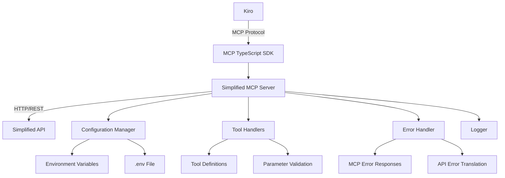

# Design Document

## Overview

The Simplified MCP Server is a JavaScript-based Model Context Protocol server that acts as a bridge between Kiro and Simplified's API. It will be packaged as an NPM module and provide a standardized interface for Kiro to interact with Simplified's services through MCP tools.

The server follows the MCP specification and implements a modular architecture that allows for easy extension and maintenance. It handles authentication, request/response translation, error handling, and provides comprehensive logging capabilities.

## Architecture

### High-Level Architecture



### Core Components

1. **MCP Server (using official SDK)**: Server implementation using @modelcontextprotocol/sdk-server
2. **Configuration Manager**: Manages environment variables, API tokens, and server settings
3. **Tool Handlers**: Individual tool implementations that handle MCP tool calls
4. **API Client**: Handles communication with Simplified's API
5. **Authentication Manager**: Manages API token authentication and refresh
6. **Error Handler**: Provides consistent error handling and formatting
7. **Logger**: Configurable logging system

## Components and Interfaces

### MCP Server Core (using official SDK)

```javascript
import { Server } from '@modelcontextprotocol/sdk/server/index.js';
import { StdioServerTransport } from '@modelcontextprotocol/sdk/server/stdio.js';
import { CallToolRequestSchema, ListToolsRequestSchema } from '@modelcontextprotocol/sdk/types.js';

class SimplifiedMCPServer {
  constructor(config) {
    this.config = config;
    this.server = new Server(
      {
        name: 'simplified-mcp-server',
        version: '1.0.0',
      },
      {
        capabilities: {
          tools: {},
        },
      }
    );
    this.apiClient = new SimplifiedAPIClient(config);
    this.logger = new Logger(config.logLevel);
    this.setupToolHandlers();
  }
  
  setupToolHandlers() {
    // Register tool handlers using the official SDK
    this.server.setRequestHandler(ListToolsRequestSchema, async () => {
      return { tools: this.getAvailableTools() };
    });
    
    this.server.setRequestHandler(CallToolRequestSchema, async (request) => {
      return await this.handleToolCall(request.params);
    });
  }
  
  async start() {
    const transport = new StdioServerTransport();
    await this.server.connect(transport);
  }
  
  async handleToolCall(params) { /* Process tool calls */ }
  getAvailableTools() { /* Return tool definitions */ }
}
```

### Configuration Manager

```javascript
class ConfigurationManager {
  static loadConfig() {
    return {
      apiToken: process.env.SIMPLIFIED_API_TOKEN,
      apiBaseUrl: process.env.SIMPLIFIED_API_BASE_URL || 'https://api.simplified.com',
      logLevel: process.env.LOG_LEVEL || 'info',
      timeout: parseInt(process.env.REQUEST_TIMEOUT) || 30000
    };
  }
  
  static validateConfig(config) { /* Validate required configuration */ }
}
```

### Tool Handlers (using SDK patterns)

```javascript
// Tool definitions following MCP SDK patterns
const toolDefinitions = [
  {
    name: 'simplified-api-call',
    description: 'Make a call to Simplified API',
    inputSchema: {
      type: 'object',
      properties: {
        endpoint: { type: 'string', description: 'API endpoint to call' },
        method: { type: 'string', enum: ['GET', 'POST', 'PUT', 'DELETE'] },
        data: { type: 'object', description: 'Request payload' }
      },
      required: ['endpoint', 'method']
    }
  }
];

// Tool handler implementation
async function handleToolCall(name, args, apiClient) {
  switch (name) {
    case 'simplified-api-call':
      return await apiClient.makeRequest(args.endpoint, args.method, args.data);
    default:
      throw new Error(`Unknown tool: ${name}`);
  }
}
```

### API Client

```javascript
class SimplifiedAPIClient {
  constructor(config) {
    this.baseUrl = config.apiBaseUrl;
    this.token = config.apiToken;
    this.timeout = config.timeout;
  }
  
  async makeRequest(endpoint, method, data) { /* Make API requests */ }
  async get(endpoint) { /* GET request */ }
  async post(endpoint, data) { /* POST request */ }
  async put(endpoint, data) { /* PUT request */ }
  async delete(endpoint) { /* DELETE request */ }
}
```

### Tool Definition Structure

```javascript
const toolDefinition = {
  name: 'tool-name',
  description: 'Tool description',
  inputSchema: {
    type: 'object',
    properties: {
      param1: { type: 'string', description: 'Parameter description' }
    },
    required: ['param1']
  },
  handler: async (params, apiClient) => {
    // Tool implementation
    const result = await apiClient.get(`/endpoint/${params.param1}`);
    return result;
  }
};
```

## Data Models

### MCP Request/Response Models

```javascript
// MCP Tool Call Request
const mcpToolCallRequest = {
  method: 'tools/call',
  params: {
    name: 'tool-name',
    arguments: { /* tool-specific parameters */ }
  }
};

// MCP Tool Call Response
const mcpToolCallResponse = {
  content: [
    {
      type: 'text',
      text: 'Response content'
    }
  ]
};

// MCP Error Response
const mcpErrorResponse = {
  error: {
    code: -32000,
    message: 'Error message',
    data: { /* additional error details */ }
  }
};
```

### Configuration Model

```javascript
const serverConfig = {
  apiToken: 'string',           // Required: Simplified API token
  apiBaseUrl: 'string',         // Optional: API base URL
  logLevel: 'string',           // Optional: Logging level
  timeout: 'number',            // Optional: Request timeout
  retryAttempts: 'number',      // Optional: Retry attempts
  retryDelay: 'number'          // Optional: Retry delay
};
```

### Tool Registry Model

```javascript
const toolRegistryEntry = {
  name: 'string',
  description: 'string',
  inputSchema: 'object',        // JSON Schema for input validation
  handler: 'function',          // Async function to execute tool
  category: 'string',           // Optional: Tool category
  version: 'string'             // Optional: Tool version
};
```

## Error Handling

### Error Categories

1. **Configuration Errors**: Missing or invalid configuration
2. **Authentication Errors**: Invalid or expired API tokens
3. **API Errors**: Errors from Simplified's API
4. **MCP Protocol Errors**: Invalid MCP requests or responses
5. **Tool Execution Errors**: Errors during tool execution

### Error Handling Strategy

```javascript
class ErrorHandler {
  static handleError(error, context) {
    const mcpError = this.translateToMCPError(error);
    this.logError(error, context);
    return mcpError;
  }
  
  static translateToMCPError(error) {
    switch (error.type) {
      case 'AUTH_ERROR':
        return { code: -32001, message: 'Authentication failed' };
      case 'API_ERROR':
        return { code: -32002, message: 'API request failed', data: error.details };
      case 'VALIDATION_ERROR':
        return { code: -32602, message: 'Invalid parameters', data: error.details };
      default:
        return { code: -32000, message: 'Internal error' };
    }
  }
}
```

### Retry Logic

```javascript
class RetryHandler {
  static async withRetry(operation, maxAttempts = 3, delay = 1000) {
    for (let attempt = 1; attempt <= maxAttempts; attempt++) {
      try {
        return await operation();
      } catch (error) {
        if (attempt === maxAttempts || !this.isRetryableError(error)) {
          throw error;
        }
        await this.delay(delay * attempt);
      }
    }
  }
  
  static isRetryableError(error) {
    return error.status >= 500 || error.code === 'NETWORK_ERROR';
  }
}
```

## Testing Strategy

### Unit Testing

- **Configuration Manager**: Test configuration loading and validation
- **Tool Registry**: Test tool registration, retrieval, and validation
- **API Client**: Test HTTP request handling and error scenarios
- **Error Handler**: Test error translation and formatting
- **Individual Tools**: Test each tool's functionality and parameter validation

### Integration Testing

- **MCP Protocol Compliance**: Test server responses conform to MCP specification
- **API Integration**: Test actual calls to Simplified's API (with test environment)
- **End-to-End Workflows**: Test complete request/response cycles

### Test Structure

```javascript
// Example test structure
describe('SimplifiedMCPServer', () => {
  describe('Tool Registry', () => {
    it('should register tools correctly', () => { /* test */ });
    it('should validate tool parameters', () => { /* test */ });
    it('should handle invalid tool calls', () => { /* test */ });
  });
  
  describe('API Client', () => {
    it('should make authenticated requests', () => { /* test */ });
    it('should handle API errors gracefully', () => { /* test */ });
    it('should retry failed requests', () => { /* test */ });
  });
  
  describe('MCP Protocol', () => {
    it('should handle tool calls correctly', () => { /* test */ });
    it('should return valid MCP responses', () => { /* test */ });
    it('should handle protocol errors', () => { /* test */ });
  });
});
```

### Mock Strategy

- Mock Simplified API responses for consistent testing
- Mock MCP client requests for server testing
- Use dependency injection for easier mocking
- Provide test utilities for common scenarios

## NPM Package Structure

### Package.json Configuration

```json
{
  "name": "simplified-mcp-server",
  "version": "1.0.0",
  "description": "MCP server for Simplified API integration",
  "main": "dist/index.js",
  "types": "dist/index.d.ts",
  "type": "module",
  "bin": {
    "simplified-mcp-server": "dist/cli.js"
  },
  "scripts": {
    "build": "tsc",
    "test": "jest",
    "start": "node dist/index.js",
    "dev": "ts-node --esm src/index.ts"
  },
  "dependencies": {
    "@modelcontextprotocol/sdk": "^0.5.0",
    "axios": "^1.6.0",
    "dotenv": "^16.3.0",
    "zod": "^3.22.0"
  },
  "devDependencies": {
    "@types/node": "^20.0.0",
    "typescript": "^5.0.0",
    "jest": "^29.0.0",
    "ts-node": "^10.0.0",
    "@types/jest": "^29.0.0"
  }
}
```

### Directory Structure

```
simplified-mcp-server/
├── src/
│   ├── index.ts              # Main entry point
│   ├── server.ts             # MCP server implementation
│   ├── config/
│   │   └── configuration.ts  # Configuration management
│   ├── tools/
│   │   ├── registry.ts       # Tool registry
│   │   └── definitions/      # Individual tool definitions
│   ├── api/
│   │   └── client.ts         # Simplified API client
│   ├── utils/
│   │   ├── errors.ts         # Error handling
│   │   └── logger.ts         # Logging utilities
│   └── types/
│       └── index.ts          # TypeScript type definitions
├── dist/                     # Compiled JavaScript
├── tests/                    # Test files
├── docs/                     # Documentation
├── .env.example              # Environment variable template
├── README.md                 # Package documentation
└── package.json
```

### CLI Interface

```javascript
#!/usr/bin/env node
// cli.js - Command line interface for the MCP server
import { SimplifiedMCPServer } from './server.js';
import { ConfigurationManager } from './config/configuration.js';

async function main() {
  try {
    const config = ConfigurationManager.loadConfig();
    ConfigurationManager.validateConfig(config);
    
    const server = new SimplifiedMCPServer(config);
    await server.start();
    
    // Server runs via stdio transport - no additional logging needed
    // The MCP SDK handles the communication protocol
  } catch (error) {
    console.error('Failed to start server:', error.message);
    process.exit(1);
  }
}

main();
```